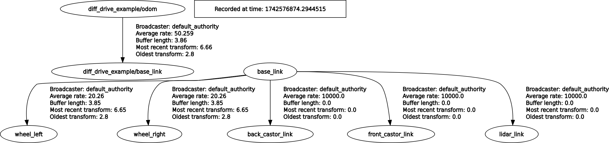

# ZLIO-SAM
This branch shows 
- how to set sensors, i.e. a 3D LIDAR and a 9-axis IMU, in Gazebo, 
- what the tf tree should be like before and after running LIO-SAM,
- how to set parameters based on sensor inputs to run LIO-SAM.

It has been tested in Gazebo, ROS2 Humble.
## Steps to run LIO-SAM in simulation

## 1. Configure robot in Gazebo simulation
The objective is to simulate a mobile robot with a 3D Lidar and an IMU attached in Gazebo. 

The method is to model the mobile robot and sensors's physical features and functions in urdf files, which Gazebo uses to simulate the robot and sensors.

<p align='center'>
    
</p>
It should have a complete tf tree of robot which can demonstrate robot movement in Rviz2
<p align='center'>
    
</p>
and its strcture can be shown in tf_tree.
<p align='center'>
    
</p>
Please ignore diff_drive_example/odom and diff_drive_example/base_link. They appear due to the simulated robot.

### 1.1 Define LIDAR sensor in URDR/XACRO
It is possible to first design the physical size, material and inertia of the 3D LIDAR. Its aim is to help users consider where and how to mount the sensor through simulation.

We use a link to model the 3D LIDAR's physical characteristics in this example. Users can find these parameters from the datasheet of your LIDAR. With the definition below, the LIDAR sensor's physical features are well modeled.

```xml
  <!-- Lidar Link -->
  <link name="lidar_link">
      <visual>
          <geometry>
              <mesh filename="lidar_stl_address.stl" scale="1 1 1"/>
          </geometry>
          <material name="uom_yellow"/>
          <origin xyz="0 0 0" rpy="0 0 0"/>
      </visual>

      <xacro:box_collision x="${lidar_width}" y="${lidar_width}" z="${lidar_height}" origin_z="-0.015"/>

      <xacro:box_inertia x="${lidar_width}" y="${lidar_width}" z="${lidar_height}" mass="${lidar_mass}" origin_z="-0.015"/>
  </link>
```

Then, where to mount the LIDAR is decided by the relative pose of *lidar_link* with respect to *base_link*. Usually, *base_link* is considered to be the one that connects every part of the robot. The relative pose depends on the joint *base_lidar_joint* that links *lidar_link* and *base_link*.

It is important to note that ```<origin xyz="0 0 0.3" rpy="0 0 0"/>``` describes the pose of the child link *lidar_link* relative to the parent link *base_link*. In our case, the LIDAR is positioned 0.3m above the *base_link* along the z-axis.

```xml
<joint name="base_lidar_joint" type="fixed">
    <parent link="base_link"/>
    <child link="lidar_link"/>
    <origin xyz="0 0 0.3" rpy="0 0 0"/>
</joint>
```
Then, we need to achieve the functions of LIDAR, that is make the sensor publish measurement as outputs. 
VLP16 can produce both pointcloud2 and laserscan as outputs, then we need to configure two different sensors for LIDAR here.


```xml
  <gazebo reference="lidar_link">
    <sensor type="gpu_lidar" name="generic_lidar_sensor">
        <update_rate>50</update_rate>
        <visualize>true</visualize>
        <always_on>true</always_on>
        <frame_id>lidar_link</frame_id>
        <ignition_frame_id>lidar_link</ignition_frame_id>
        <topic>/model/diff_drive_example/points</topic>
        <lidar>
          <scan>
              <horizontal>
                <samples>1800</samples>
                <resolution>0.2</resolution>
                <min_angle>-3.1415926</min_angle>
                <max_angle>3.1415926</max_angle>
              </horizontal>
              <vertical>
                <samples>16</samples>
                <resolution>2</resolution>
                <min_angle>-0.261799</min_angle>
                <max_angle>0.261799</max_angle>
              </vertical>
            </scan>
            <range>
              <min>0.3</min>
              <max>100</max>
              <resolution>0.001</resolution>
            </range>
        </lidar>
    </sensor>
    <!-- 2d lidar -->
    <sensor type="gpu_lidar" name="generic_twold_lidar_sensor">
      <topic>/model/diff_drive_example/scan</topic>
      <frame_id>lidar_link</frame_id>
      <ignition_frame_id>lidar_link</ignition_frame_id>
      <update_rate>50.0</update_rate>
      <ray>
        <scan>
          <horizontal>
            <samples>270</samples>
            <resolution>1</resolution>
            <min_angle>-${pi*0.75}</min_angle>
            <max_angle>${pi*0.75}</max_angle>
          </horizontal>
        </scan>
        <range>
          <min>0.10</min>
          <max>8.0</max>
          <resolution>0.06</resolution>
        </range>
        <noise>
          <type>gaussian</type>
          <mean>0.0</mean>
          <stddev>0.02</stddev>
        </noise>
      </ray>
      <always_on>1</always_on>
      <visualize>true</visualize>
    </sensor>
  </gazebo>
  <gazebo>  
    <plugin filename="libignition-gazebo-sensors-system.so" name="ignition::gazebo::systems::Sensors">
      <render_engine>ogre2</render_engine>
    </plugin>
  </gazebo>
```

In terms of pointcloud2, we can assign  
- frequency with ```<update_rate>${update_rate}</update_rate>```
- the link, or frame id, where sensor is attached to, ```      <frame_id>lidar_link</frame_id>``` and ```<ignition_frame_id>lidar_link</ignition_frame_id>```
- horizontal resolution equals to (*max_angle*-*min_angle*)/*samples* where we can find field of view as 360d and resolution as 0.2d (600rpm) to compute samples that should be 1800,
- vertical samples as the number of channels,
- range is 0 to 100m.
```xml
       <sensor type="gpu_lidar" name="generic_lidar_sensor">
        <update_rate>50</update_rate>
        <visualize>true</visualize>
        <always_on>true</always_on>
        <frame_id>lidar_link</frame_id>
        <ignition_frame_id>lidar_link</ignition_frame_id>
        <topic>/model/diff_drive_example/points</topic>
        <lidar>
          <scan>
              <horizontal>
                <samples>1800</samples>
                <resolution>0.2</resolution>
                <min_angle>-3.1415926</min_angle>
                <max_angle>3.1415926</max_angle>
              </horizontal>
              <vertical>
                <samples>16</samples>
                <resolution>2</resolution>
                <min_angle>-0.261799</min_angle>
                <max_angle>0.261799</max_angle>
              </vertical>
            </scan>
            <range>
              <min>0.3</min>
              <max>100</max>
              <resolution>0.01</resolution>
            </range>
        </lidar>
    </sensor>
```
Here is the datasheet from VLP16.
<p align='center'>
    
</p>

The 2D lidar is simulated based on the horizontal data of VLP16.
```xml
    <!-- 2d lidar -->
    <sensor type="gpu_lidar" name="generic_twold_lidar_sensor">
      <topic>/model/diff_drive_example/scan</topic>
      <frame_id>lidar_link</frame_id>
      <ignition_frame_id>lidar_link</ignition_frame_id>
      <update_rate>50.0</update_rate>
      <ray>
        <scan>
          <horizontal>
                <samples>1800</samples>
                <resolution>0.2</resolution>
                <min_angle>-3.1415926</min_angle>
                <max_angle>3.1415926</max_angle>
          </horizontal>
        </scan>
        <range>
          <min>0.3</min>
          <max>100</max>
          <resolution>0.01</resolution>
        </range>
        <noise>
          <type>gaussian</type>
          <mean>0.0</mean>
          <stddev>0.02</stddev>
        </noise>
      </ray>
      <always_on>1</always_on>
      <visualize>true</visualize>
    </sensor>
```

Finally, ``` <topic>/model/diff_drive_example/points</topic>``` in 3D LIDAR and ```<topic>/model/diff_drive_example/scan</topic>``` in 2D LIDAR will be used by ros2-gazebo bridge to produce pointcloud2 and lasercan output.  

### 1.2 Configure IMU sensor
It is quite common to attach the IMU to the base_link. There are fewer parameters to set compared to the LIDAR.

We need to set the frequency of the IMU with ```<update_rate>100</update_rate>``` based on our sensor. Additionally, it is possible to set bias and noise for each axis for both linear acceleration and angular rate.

```xml
 <gazebo reference="base_link">
    <sensor name="imu_sensor" type="imu">
      <topic>/model/diff_drive_example/imu</topic>
      <frame_id>base_link</frame_id>
      <ignition_frame_id>base_link</ignition_frame_id>
      <plugin filename="libignition-gazebo-imu-system.so" name="ignition::gazebo::systems::Imu">
        <initial_orientation_as_reference>false</initial_orientation_as_reference>
      </plugin>
      <always_on>true</always_on>
      <update_rate>100</update_rate>
      <visualize>true</visualize>
     <imu>
     	<angular_velocity>
     	  <x>
     	    <noise type="gaussian">
              <mean>0.0</mean>
              <stddev>2e-4</stddev>
              <bias_mean>0.0000075</bias_mean>
              <bias_stddev>0.0000008</bias_stddev>
            </noise>
          </x>
          <y>
            <noise type="gaussian">
              <mean>0.0</mean>
              <stddev>2e-4</stddev>
              <bias_mean>0.0000075</bias_mean>
              <bias_stddev>0.0000008</bias_stddev>
            </noise>
          </y>
          <z>
            <noise type="gaussian">
              <mean>0.0</mean>
              <stddev>2e-4</stddev>
              <bias_mean>0.0000075</bias_mean>
              <bias_stddev>0.0000008</bias_stddev>
            </noise>
          </z>
        </angular_velocity>
        <linear_acceleration>
          <x>
            <noise type="gaussian">
              <mean>0.0</mean>
              <stddev>1.7e-2</stddev>
              <bias_mean>0.1</bias_mean>
              <bias_stddev>0.001</bias_stddev>
            </noise>
          </x>
          <y>
            <noise type="gaussian">
              <mean>0.0</mean>
              <stddev>1.7e-2</stddev>
              <bias_mean>0.1</bias_mean>
              <bias_stddev>0.001</bias_stddev>
            </noise>
          </y>
          <z>
            <noise type="gaussian">
              <mean>0.0</mean>
              <stddev>1.7e-2</stddev>
              <bias_mean>0.1</bias_mean>
              <bias_stddev>0.001</bias_stddev>
            </noise>
          </z>
        </linear_acceleration>
      </imu>
    </sensor>
  </gazebo>
```

### 1.3 Set Gazebo-ROS2 bridge (optional)

## 2 Configure and run LIO-SAM parameters
### 2.1 LIO-SAM and tf tree
In the launch file, we must comment the lines call *robot_state_publisher*. This is because the tf tree showing robot components and sensors is created by the simulated robot.

```yaml
        # Node(
        #     package='robot_state_publisher',
        #     executable='robot_state_publisher',
        #     name='robot_state_publisher',
        #     output='screen',
        #     parameters=[{
        #         'robot_description': Command(['xacro', ' ', xacro_path])
        #     }]
        # ),
```

We can also note that this launch files publish a tf transform between map and odom.

```python
        Node(
            package='tf2_ros',
            executable='static_transform_publisher',
            arguments='0.0 0.0 0.0 0.0 0.0 0.0 map odom'.split(' '),
            parameters=[parameter_file],
            output='screen'
            ),
```

Therefore, launching LIO-SAM (custsim branch) with ```run.launch.py``` will create 2 tf transforms: a fixed one between *odom* and *map* and a dynamic one between *odom* and *base_link*.

<p align='center'>
    
</p>

### 2.2 LIO-SAM, sensor inputs and tf transforms

In ```conifg/params.yaml``` we need to specify sensors' inputs, i.e. a 3D Lidar and an IMU, as well as frames that to be used to construct the tf tree.

1. Decide topics that contain imu data and lidar data.
  ```yaml
      pointCloudTopic: "/points"          # Point cloud data
      imuTopic: "/imu_raw"                # IMU data
  ```
2. We only need to care about *baselinkFrame*, *odometryFrame* and *mapFrame*. Because because LIO-SAM on this branch only publishes the tf transform between *baselinkFrame*  and *odometryFrame*
```yaml
    # Frames
    lidarFrame: "lidar_link"   # frame name of lidar_link (in fact, it does not matter what you put here)
    baselinkFrame: "base_link" # frame name of base_link (check the base frame of your robot, here is where map/odom will be linked to the robot)
    odometryFrame: "odom" # frame name for odometry (keep it as default)
    mapFrame: "map"       # frame name for global map (keep it as default)
```
3. Obtain sensor settings for LIDAR and IMU. As a matter of fact, ```N_SCAN``` depends on ```<samples>16</samples>``` in the section ```<vertical>``` ; ```Horizon_SCAN``` is from <samples>1800</samples> in the section ```<horizontal>```. TODO: check units of ```lidarMinRange``` and ```lidarMaxRange```.

    It leads to
  ```yaml
        # Sensor Settings
      sensor: velodyne                               # lidar sensor type, either 'velodyne', 'ouster' or 'livox'
      N_SCAN: 16                                  # number of lidar channels (i.e., Velodyne/Ouster: 16, 32, 64, 128, Livox Horizon: 6)
      Horizon_SCAN: 1800                            # lidar horizontal resolution (Velodyne:1800, Ouster:512,1024,2048, Livox Horizon: 4000)
      downsampleRate: 1                            # default: 1. Downsample your data if too many
      # points. i.e., 16 = 64 / 4, 16 = 16 / 1
      lidarMinRange: 1.0                           # default: 1.0, minimum lidar range to be used
      lidarMaxRange: 1000.0                        # default: 1000.0, maximum lidar range to be used
  ```

  Then, ```imuAccNoise``` and ```imuAccBiasN``` are from  ```<stddev>1.7e-2</stddev>``` and  ```<bias_stddev>0.001</bias_stddev>``` in the section ```linear_acceleration``` and ```imuGyrNoise``` and ```imuGyrBiasN``` are based on ```<stddev>2e-4</stddev>``` and ```<bias_stddev>0.0000008</bias_stddev>``` in the section ```angular_velocity``` of IMU.
```yaml
    # IMU Settings
    imuAccNoise: 1.7e-2
    imuGyrNoise: 2.0e-4
    imuAccBiasN: 0.001
    imuGyrBiasN: 0.0000008

    imuGravity: 9.80511
    imuRPYWeight: 0.01
```

NOTE: IMU is attached to ```base_link```, then it is the relative pose of your LIDAR *lidar_link* with respect to your *base_link*. It is very important to notice that here *lidar_link* and *base_link* are links of your simulated robot, which is designed in Gazebo or other simulator and can be found in your urdf or xacro files.

In our case, *lidiar_link* is 0.3m above *base_link* and their attitudes are the same.

```yaml
    extrinsicTrans:  [ 0.0,  0.0,  0.3]          # position of LIDAR in the frame of base_link (where IMU is attached)
    extrinsicRot:    [ 1.0,  0.0,  0.0,          # rotation matrix that represents linear acc measured by IMU expressed in lidar_frame
                       0.0, 1.0,  0.0,
                       0.0,  0.0, 1.0 ]
    extrinsicRPY: [ 1.0,  0.0,  0.0,             # rotation matrix that represents angular velocity measured by IMU expressed in lidar_frame
                    0.0,  1.0,  0.0,
                    0.0,  0.0,  1.0 ]
```
### 2.3 LIO-SAM other parameters (TO BE CONTINUED)
There are other parameters that can be tuned.


### 2.4 Run LIO-SAM

Before running LIO-SAM, we can use Rviz2 to display pointclouds of 3D LIDAR choosing the *base_link* or *lidiar_link* as the global frame. 

If pointcloud can be viewed, then it is the time to run LIO-SAM after starting your simulation. 

```shell
  ros2 launch lio_sam run.launch.py

```

---

# LIO-SAM (Origin)

**A real-time lidar-inertial odometry package. We strongly recommend the users read this document thoroughly and test the package with the provided dataset first. A video of the demonstration of the method can be found on [YouTube](https://www.youtube.com/watch?v=A0H8CoORZJU).**

<p align='center'>
    
</p>

<p align='center'>
    
    
    
    
</p>

## Menu

  - [**System architecture**](#system-architecture)

  - [**Notes on ROS2 branch**](#notes-on-ros2-branch)

  - [**Package dependency**](#dependency)

  - [**Package install**](#install)

  - [**Prepare lidar data**](#prepare-lidar-data) (must read)

  - [**Prepare IMU data**](#prepare-imu-data) (must read)

  - [**Sample datasets**](#sample-datasets)

  - [**Run the package**](#run-the-package)

  - [**Other notes**](#other-notes)

  - [**Issues**](#issues)

  - [**Paper**](#paper)

  - [**TODO**](#todo)

  - [**Related Package**](#related-package)

  - [**Acknowledgement**](#acknowledgement)

## System architecture

<p align='center'>
    
</p>

We design a system that maintains two graphs and runs up to 10x faster than real-time.
  - The factor graph in "mapOptimization.cpp" optimizes lidar odometry factor and GPS factor. This factor graph is maintained consistently throughout the whole test.
  - The factor graph in "imuPreintegration.cpp" optimizes IMU and lidar odometry factor and estimates IMU bias. This factor graph is reset periodically and guarantees real-time odometry estimation at IMU frequency.

## Notes on ROS2 branch

There are some features of the original ROS1 version that are currently missing in this ROS2 version, namely:
- Testing with Velodyne & Livox lidars and Microstrain IMUs
- A launch file for the navsat module/GPS factor
- The rviz2 configuration misses many elements

This branch was tested with Ouster lidars, Xsens IMUs and SBG-Systems IMUs using the following ROS2 drivers:
- [ros2_ouster_drivers](https://github.com/ros-drivers/ros2_ouster_drivers)
- [bluespace_ai_xsens_ros_mti_driver](https://github.com/bluespace-ai/bluespace_ai_xsens_ros_mti_driver)
- [sbg_ros2_driver](https://github.com/SBG-Systems/sbg_ros2_driver)

In these tests, the IMU was mounted on the bottom of the lidar such that their x-axes pointed in the same direction. The parameters `extrinsicRot` and `extrinsicRPY` in `params.yaml` correspond to this constellation.

## Dependencies

Tested with ROS2 versions foxy and galactic on Ubuntu 20.04 and humble on Ubuntu 22.04
- [ROS2](https://docs.ros.org/en/humble/Installation.html)
  ```
  sudo apt install ros-<ros2-version>-perception-pcl \
		   ros-<ros2-version>-pcl-msgs \
		   ros-<ros2-version>-vision-opencv \
		   ros-<ros2-version>-xacro
  ```
- [gtsam](https://gtsam.org/get_started) (Georgia Tech Smoothing and Mapping library)
  ```
  # Add GTSAM-PPA
  sudo add-apt-repository ppa:borglab/gtsam-release-4.1
  sudo apt install libgtsam-dev libgtsam-unstable-dev
  ```

## Install

Use the following commands to download and compile the package.

  ```
  cd ~/ros2_ws/src
  git clone https://github.com/TixiaoShan/LIO-SAM.git
  cd lio-sam
  git checkout ros2
  cd ..
  colcon build
  ```

## Using Docker

Build image (based on ROS2 Humble):

```
docker build -t liosam-humble-jammy .
```

Once you have the image, you can start a container by using one of the following methods:

1. `docker run`

```
docker run --init -it -d \
  --name liosam-humble-jammy-container \
  -v /etc/localtime:/etc/localtime:ro \
  -v /etc/timezone:/etc/timezone:ro \
  -v /tmp/.X11-unix:/tmp/.X11-unix \
  -e DISPLAY=$DISPLAY \
  --runtime=nvidia --gpus all \
  liosam-humble-jammy \
  bash
```

2. `docker compose`

Start a docker compose container:

```
docker compose up -d
```

Stopping a docker compose container:
```
docker compose down
```

To enter into the running container use:

```
docker exec -it liosam-humble-jammy-container bash
```
## Prepare lidar data

The user needs to prepare the point cloud data in the correct format for cloud deskewing, which is mainly done in "imageProjection.cpp". The two requirements are:
  - **Provide point time stamp**. LIO-SAM uses IMU data to perform point cloud deskew. Thus, the relative point time in a scan needs to be known. The up-to-date Velodyne ROS driver should output this information directly. Here, we assume the point time channel is called "time." The definition of the point type is located at the top of the "imageProjection.cpp." "deskewPoint()" function utilizes this relative time to obtain the transformation of this point relative to the beginning of the scan. When the lidar rotates at 10Hz, the timestamp of a point should vary between 0 and 0.1 seconds. If you are using other lidar sensors, you may need to change the name of this time channel and make sure that it is the relative time in a scan.
  - **Provide point ring number**. LIO-SAM uses this information to organize the point correctly in a matrix. The ring number indicates which channel of the sensor that this point belongs to. The definition of the point type is located at the top of "imageProjection.cpp." The up-to-date Velodyne ROS driver should output this information directly. Again, if you are using other lidar sensors, you may need to rename this information. Note that only mechanical lidars are supported by the package currently.

## Prepare IMU data

  - **IMU requirement**. Like the original LOAM implementation, LIO-SAM only works with a 9-axis IMU, which gives roll, pitch, and yaw estimation. The roll and pitch estimation is mainly used to initialize the system at the correct attitude. The yaw estimation initializes the system at the right heading when using GPS data. Theoretically, an initialization procedure like VINS-Mono will enable LIO-SAM to work with a 6-axis IMU. The performance of the system largely depends on the quality of the IMU measurements. The higher the IMU data rate, the better the system accuracy. We use Microstrain 3DM-GX5-25, which outputs data at 500Hz. We recommend using an IMU that gives at least a 200Hz output rate. Note that the internal IMU of Ouster lidar is an 6-axis IMU.

  - **IMU alignment**. LIO-SAM transforms IMU raw data from the IMU frame to the Lidar frame, which follows the ROS REP-105 convention (x - forward, y - left, z - upward). To make the system function properly, the correct extrinsic transformation needs to be provided in "params.yaml" file. **The reason why there are two extrinsics is that my IMU (Microstrain 3DM-GX5-25) acceleration and attitude have different coordinates. Depending on your IMU manufacturer, the two extrinsics for your IMU may or may not be the same**.
    - "extrinsicRot" in "params.yaml" is a rotation matrix that transforms IMU gyro and acceleometer measurements to lidar frame.
    - "extrinsicRPY" in "params.yaml" is a rotation matrix that transforms IMU orientation to lidar frame.

  - **IMU debug**. It's strongly recommended that the user uncomment the debug lines in "imuHandler()" of "imageProjection.cpp" and test the output of the transformed IMU data. The user can rotate the sensor suite to check whether the readings correspond to the sensor's movement. A YouTube video that shows the corrected IMU data can be found [here (link to YouTube)](https://youtu.be/BOUK8LYQhHs).


<p align='center'>
    
</p>
<p align='center'>
    
</p>

## Sample datasets

For privacy reasons, no data set can currently be made available for ROS2.

README.md of the master branch contains some links to ROS1 rosbags. It is possible to use [ros1_bridge](https://github.com/ros2/ros1_bridge) with these rosbags, but verify timing behavior (message frequency in ROS2) first. Mind [DDS tuning](https://docs.ros.org/en/humble/How-To-Guides/DDS-tuning.html).

## Run the package

1. Run the launch file:
```
ros2 launch lio_sam run.launch.py
```

2. Play existing bag files:
```
ros2 bag play your-bag.bag
```

## Save map
```
ros2 service call /lio_sam/save_map lio_sam/srv/SaveMap
```
```
ros2 service call /lio_sam/save_map lio_sam/srv/SaveMap "{resolution: 0.2, destination: /Downloads/service_LOAM}"
```
## Other notes

  - **Loop closure:** The loop function here gives an example of proof of concept. It is directly adapted from LeGO-LOAM loop closure. For more advanced loop closure implementation, please refer to [ScanContext](https://github.com/irapkaist/SC-LeGO-LOAM). Set the "loopClosureEnableFlag" in "params.yaml" to "true" to test the loop closure function. In Rviz, uncheck "Map (cloud)" and check "Map (global)". This is because the visualized map - "Map (cloud)" - is simply a stack of point clouds in Rviz. Their postion will not be updated after pose correction. The loop closure function here is simply adapted from LeGO-LOAM, which is an ICP-based method. Because ICP runs pretty slow, it is suggested that the playback speed is set to be "-r 1". You can try the Garden dataset for testing.

<p align='center'>
    
    
</p>

  - **Using GPS:** The park dataset is provided for testing LIO-SAM with GPS data. This dataset is gathered by [Yewei Huang](https://robustfieldautonomylab.github.io/people.html). To enable the GPS function, change "gpsTopic" in "params.yaml" to "odometry/gps". In Rviz, uncheck "Map (cloud)" and check "Map (global)". Also check "Odom GPS", which visualizes the GPS odometry. "gpsCovThreshold" can be adjusted to filter bad GPS readings. "poseCovThreshold" can be used to adjust the frequency of adding GPS factor to the graph. For example, you will notice the trajectory is constantly corrected by GPS whey you set "poseCovThreshold" to 1.0. Because of the heavy iSAM optimization, it's recommended that the playback speed is "-r 1".

<p align='center'>
    
</p>

  - **KITTI:** Since LIO-SAM needs a high-frequency IMU for function properly, we need to use KITTI raw data for testing. One problem remains unsolved is that the intrinsics of the IMU are unknown, which has a big impact on the accuracy of LIO-SAM. Download the provided sample data and make the following changes in "params.yaml":
    - extrinsicTrans: [-8.086759e-01, 3.195559e-01, -7.997231e-01]
    - extrinsicRot: [9.999976e-01, 7.553071e-04, -2.035826e-03, -7.854027e-04, 9.998898e-01, -1.482298e-02, 2.024406e-03, 1.482454e-02, 9.998881e-01]
    - extrinsicRPY: [9.999976e-01, 7.553071e-04, -2.035826e-03, -7.854027e-04, 9.998898e-01, -1.482298e-02, 2.024406e-03, 1.482454e-02, 9.998881e-01]
    - N_SCAN: 64
    - downsampleRate: 2 or 4
    - loopClosureEnableFlag: true or false

<p align='center'>
    
    
</p>

  - **Ouster lidar:** To make LIO-SAM work with Ouster lidar, some preparations needs to be done on hardware and software level.
    - Hardware:
      - Use an external IMU. LIO-SAM does not work with the internal 6-axis IMU of Ouster lidar. You need to attach a 9-axis IMU to the lidar and perform data-gathering.
      - Configure the driver. Change "timestamp_mode" in your Ouster launch file to "TIME_FROM_PTP_1588" so you can have ROS format timestamp for the point clouds.
    - Config:
      - Change "sensor" in "params.yaml" to "ouster".
      - Change "N_SCAN" and "Horizon_SCAN" in "params.yaml" according to your lidar, i.e., N_SCAN=128, Horizon_SCAN=1024.
    - Gen 1 and Gen 2 Ouster:
      It seems that the point coordinate definition might be different in different generations. Please refer to [Issue #94](https://github.com/TixiaoShan/LIO-SAM/issues/94) for debugging.

<p align='center'>
    
    
</p>

## Issues

  - **Zigzag or jerking behavior**: if your lidar and IMU data formats are consistent with the requirement of LIO-SAM, this problem is likely caused by un-synced timestamp of lidar and IMU data.

  - **Jumpping up and down**: if you start testing your bag file and the base_link starts to jump up and down immediately, it is likely your IMU extrinsics are wrong. For example, the gravity acceleration has negative value.

  - **mapOptimization crash**: it is usually caused by GTSAM. Please install the GTSAM specified in the README.md. More similar issues can be found [here](https://github.com/TixiaoShan/LIO-SAM/issues).

  - **gps odometry unavailable**: it is generally caused due to unavailable transform between message frame_ids and robot frame_id (for example: transform should be available from "imu_frame_id" and "gps_frame_id" to "base_link" frame. Please read the Robot Localization documentation found [here](http://docs.ros.org/en/melodic/api/robot_localization/html/preparing_sensor_data.html).

## Paper

Thank you for citing [LIO-SAM (IROS-2020)](./config/doc/paper.pdf) if you use any of this code.
```
@inproceedings{liosam2020shan,
  title={LIO-SAM: Tightly-coupled Lidar Inertial Odometry via Smoothing and Mapping},
  author={Shan, Tixiao and Englot, Brendan and Meyers, Drew and Wang, Wei and Ratti, Carlo and Rus Daniela},
  booktitle={IEEE/RSJ International Conference on Intelligent Robots and Systems (IROS)},
  pages={5135-5142},
  year={2020},
  organization={IEEE}
}
```

Part of the code is adapted from [LeGO-LOAM](https://github.com/RobustFieldAutonomyLab/LeGO-LOAM).
```
@inproceedings{legoloam2018shan,
  title={LeGO-LOAM: Lightweight and Ground-Optimized Lidar Odometry and Mapping on Variable Terrain},
  author={Shan, Tixiao and Englot, Brendan},
  booktitle={IEEE/RSJ International Conference on Intelligent Robots and Systems (IROS)},
  pages={4758-4765},
  year={2018},
  organization={IEEE}
}
```

## TODO

  - [ ] [Bug within imuPreintegration](https://github.com/TixiaoShan/LIO-SAM/issues/104)

## Related Package

  - [Lidar-IMU calibration](https://github.com/chennuo0125-HIT/lidar_imu_calib)
  - [LIO-SAM with Scan Context](https://github.com/gisbi-kim/SC-LIO-SAM)

## Acknowledgement

  - LIO-SAM is based on LOAM (J. Zhang and S. Singh. LOAM: Lidar Odometry and Mapping in Real-time).
